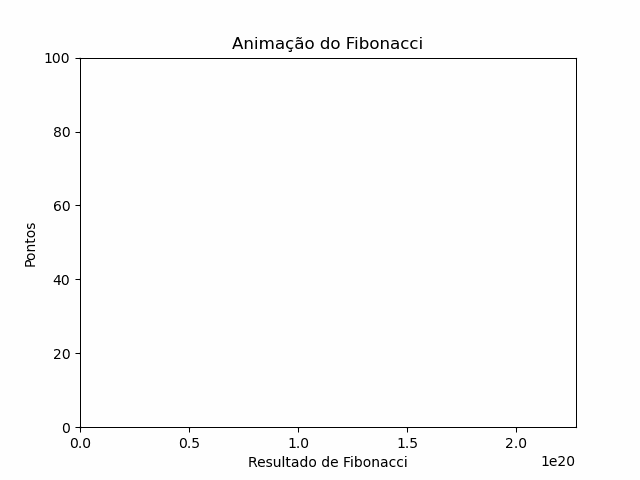

# Cálculo da Sequência de Fibonacci em Fortran 🌀

Implementação do cálculo da sequência de Fibonacci em Fortran.

A sequência de Fibonacci é uma série numérica onde cada número é a soma dos dois anteriores, começando com 0 e 1. Este programa em Fortran calcula os primeiros n termos da sequência de Fibonacci.

## Sobre o Programa ℹ️

Este programa em Fortran demonstra como calcular os termos da sequência de Fibonacci até um número específico n. Ele utiliza uma abordagem recursiva simples para calcular cada termo da sequência.

## Exemplo de Código

Aqui está um exemplo do código em Fortran para calcular os primeiros n termos da sequência de Fibonacci:

## Exemplo de Uso com Animação 🎥

A animação abaixo mostra como a sequência de Fibonacci cresce à medida que mais termos são calculados:

