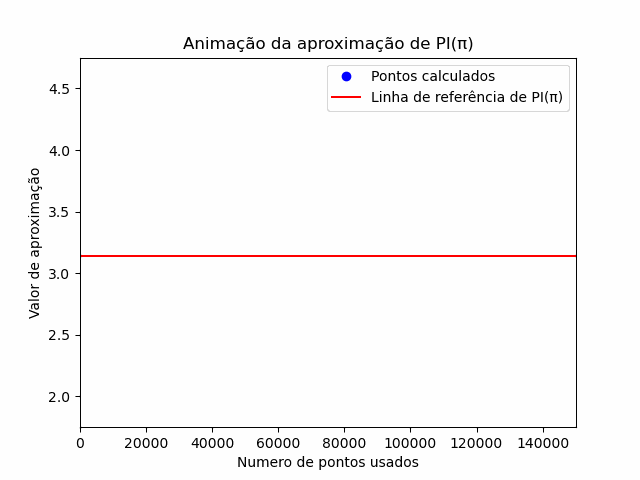

# Aproximação do Número Pi usando Método de Monte Carlo em Fortran 🥧

Implementação da aproximação do número pi usando o método de Monte Carlo em Fortran.

O método de Monte Carlo é uma técnica estatística que utiliza números aleatórios para resolver problemas diversos. Neste caso, usamos o método para estimar o valor de pi.

## Sobre o Método de Monte Carlo ℹ️

O método de Monte Carlo é aplicado aqui para calcular pi gerando aleatoriamente pontos dentro de um quadrado e verificando quantos estão dentro de um círculo inscrito. A razão entre os pontos dentro do círculo e o total de pontos gerados é utilizada para calcular uma aproximação de pi.

## Exemplo de Código em Fortran

Aqui está um exemplo do código em Fortran para aproximar o número pi usando o método de Monte Carlo:




```fortran
program teste
implicit none        
real :: u1,u2,x,xo,y,yo,L,r,ac,a1,a2,ncir2,nt2,v1,v2,v3,v4,erro,pibar,sumxi2,xi2
integer :: i,ncir,nt,n,nr=10
do nt= 100, 152222,3000
 pibar=0
 sumxi2=0
  do i=1,nr
  xo=2.0
  yo=3.0
  l=5.0
  r=1.0
  ncir=0
    do n=1,nt
      call random_number(u1)
      call random_number(u2)
      x=L*u1
      y=L*u2

      a1= (x-xo)**2+(y-yo)**2
      a2= r**2
      if(a1 .le. a2) then
        ncir=ncir+1
        !write(1,*)x,y
      end if
      if( a1 .gt. a2) then
        ! write(2,*) x,y
      end if
  end do 
     ac = l**2*ncir/nt
     xi2=ac**2
     sumxi2= sumxi2+xi2
     pibar=pibar+ac
     write(*,*) ac
    end do
 write(*,*) nt, pibar/nr 
 !write(3,*)"media", nt,pibar/nr
 erro=sqrt(sumxi2/nr-(pibar/nr)**2)
! write(4,*) nt, erro 
 write(*,*) erro
end do
end program teste
