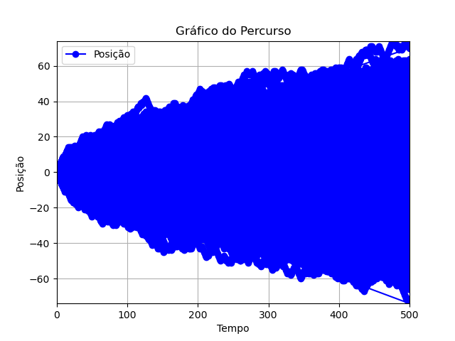
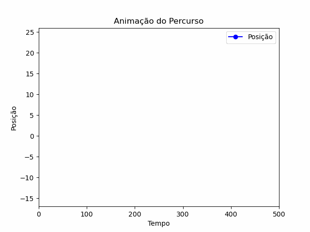

# Random Walk usando f90 🚶‍♂️🔀

Implementação de um passeio aleatório em Fortran (f90).

Um passeio aleatório é um processo estocástico onde uma partícula se move aleatoriamente de acordo com uma distribuição de probabilidade. Neste projeto, o código em Fortran simula esse processo em uma grade bidimensional, onde cada passo é determinado aleatoriamente. Esse tipo de simulação é usado em diversas áreas, como modelagem de sistemas físicos e biológicos, previsão de mercados financeiros, entre outros.

## Sobre o Projeto ℹ️

Este projeto visa demonstrar como implementar um passeio aleatório em Fortran, utilizando uma abordagem simples para gerar os movimentos da partícula. A grade é inicializada com a partícula em uma posição inicial e, a cada passo, a partícula se move aleatoriamente para uma das quatro direções possíveis (cima, baixo, esquerda, direita).

## Ilustração do Percurso 🖼️

A imagem abaixo mostra um exemplo de percurso gerado pelo código:

## Animação do Movimento 🎥

A animação a seguir demonstra o movimento da partícula ao longo do tempo:

Nesta animação, é possível observar como a partícula se move aleatoriamente na grade, criando um padrão que reflete o comportamento de um passeio aleatório.

---
